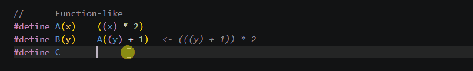
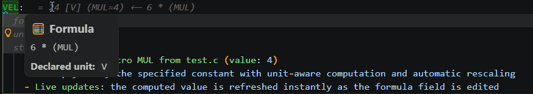
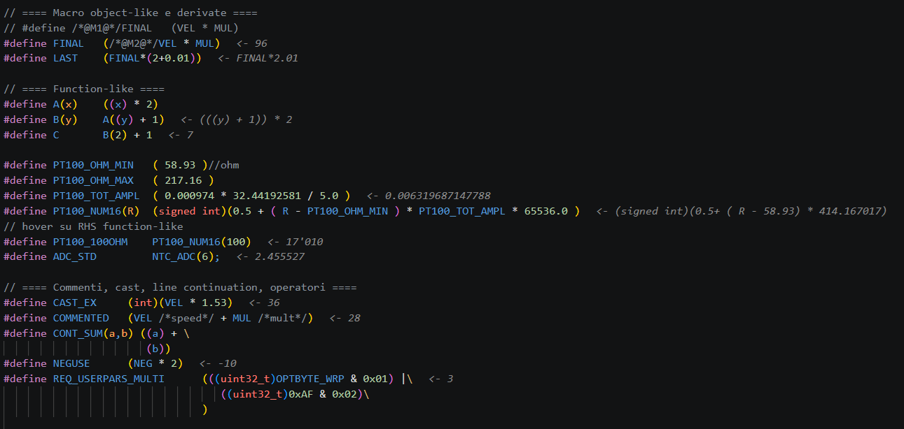
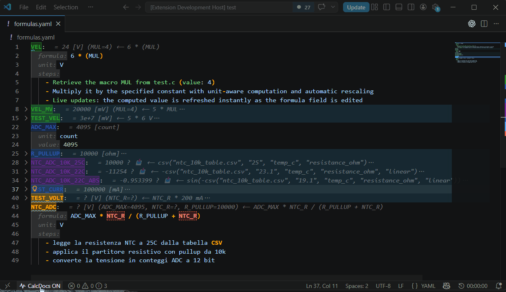
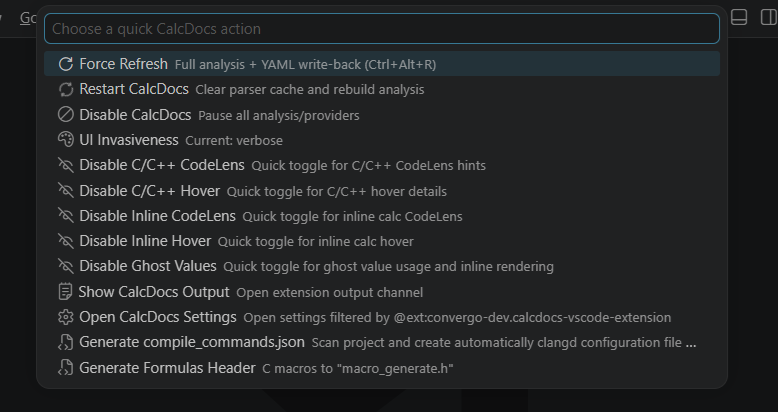

# 🧮 CalcDocs — See Your Firmware as It Actually Computes **[0.2.0-prerelease]**

[](https://visualstudio.com)
[](https://visualstudio.com)
[](./LICENSE.md)

**Stop navigating macros. Stop guessing values.**  

Embedded firmware is not hard because of logic — it's hard because values are hidden.  
CalcDocs reveals the actual computed values of your C/C++ and YAML logic directly in VS Code.  

👉 What you see is what your firmware computes.  

## Macro Chain Revelation

| Inside *C code* | Inside *formulas\*.yaml* file |
| :---: | :---: |
 |  |

## Firmware blindness before & after

| Before | After |
| :---: | :---: |
|  |  |

## Macro and constant generation header output by quick menu
| Generation | Quick menu |
| :---: | :---: |
|  |  |

---

**Understand C macros in seconds, not minutes.**  
See real computed values from your C/C++ firmware — instantly, inside VS Code.

👉 Spreadsheets hide logic. YAML exposes it.

CalcDocs shows you the *actual numeric results* of your C/C++ constants and YAML formulas — before you compile.

---

## ⚡ What problem does it solve?

In embedded and firmware projects, the real value of a variable is often hidden behind layers of indirection:

- C macros expand across multiple files and headers
- Constants depend on chained definitions
- Formulas are split between code and documentation
- YAML specifications drift away from the actual firmware logic
- Unit conversions and scaling factors are implicit and easy to misread

As a result, understanding the *actual numeric value* of something requires navigation, mental expansion, and manual tracing across the codebase.

👉 This slows down development and introduces silent, hard-to-detect errors.

---

CalcDocs removes this gap by turning firmware into a **live evaluated system**.

It shows resolved values directly in place:

- inside C/C++ code (macros, constants, expressions)
- inside YAML formula definitions (synchronized view)
- with optional dimensional consistency checks (unit-aware validation)

No file switching. No mental expansion. No guessing.

👉 You always see the *final computed value where it matters*.

---

## 📄 Formula files (YAML ↔ C/C++ synchronized view)

`formulas*.yaml` is a synchronized source of truth for firmware formulas.

CalcDocs binds YAML definitions directly into C/C++ code, showing resolved values inline without navigation or context switching.

This removes the need to trace formulas across files — values are always visible where they are used.

Example:

```yaml
MAX_SPEED:
  formula: RPM * 0.10472
  unit: m/s
```

In C/C++:

```c
#define RPM 1000
```

After lunch generate header command, CalcDocs shows directly in C:

```c
#define MAX_SPEED  (SPEED * 100)  // <- 10'472
```

---

## 👀 What you actually see

Write this:

```c
#define RPM 1000
#define SPEED (RPM * 0.10472)
```

And it will automatically SPEED →

- with ghost value enabled:
```c
#define SPEED (RPM * 0.10472)   <- 104.72
```

- with codelens enabled:
```c
// CalcDocs: #define SPEED 104.72
#define SPEED (RPM * 0.10472)
```

💡 No compile. No debug. No guessing.

--- 

# 🚀 0 → Value in seconds

1. Install the extension
2. Open a C/C++ or YAML file
3. Hover any value

✅ Done — results appear instantly

--- 

# 🔥 Why it matters (real cases)

🔥 Detect overflow before it breaks your MCU  
🔍 Understand complex macro chains instantly  
🔄 Keep YAML and C values aligned
⚠️ Catch mismatches before runtime  

--- 

# ⭐ Key Features

## ⚙️ Core Evaluation Engine
- Real-time computation of C/C++ macros, constants, and expressions
- Full macro expansion with step-by-step resolution trace
- Deterministic evaluation of firmware values without compilation

---

## 👀 Inline Intelligence
- Inline value previews directly in source code (no navigation required)
- CodeLens with resolved firmware values at a glance
- Hover-based value inspection with decimal/hex representation
- Formula traceability showing how values are derived

---

## 🧠 Hybrid Language Understanding
- clangd integration (AST-aware analysis when available)
- IntelliSense enhancement layer (non-intrusive, additive only)
- Internal parser fallback for full workspace coverage

---

## 📄 YAML ↔ Firmware Synchronization
- Bidirectional linking between `formulas*.yaml` and C/C++ code
- Shared evaluation model across code and configuration layers
- Unified view of firmware logic across files

---

## ⚖️ Analysis & Validation
- Dimensional consistency checks (unit-aware validation across formulas and code)
- Mismatch detection between YAML definitions and C/C++ values
- Conditional compilation awareness (`#if`, `#ifdef`, `#elif`, `#else`)

---

## 🔍 Diagnostics Layer
- Detection of inconsistent or overridden computed values
- Formula resolution warnings and trace flags
- Silent failure prevention for macro chains and derived constants

---

# 🧠 Who is this for?

- Embedded developers
- Firmware engineers
- Control / mechanical engineers working with formulas
- Anyone dealing with C macros + numeric logic

--- 

# ⚙️ Recommended setup (optional)

Works best with:

**Clangd LSP (highly recommended)**:  
Install [LLVM vscode-clangd](https://marketplace.visualstudio.com/items?itemName=llvm-vs-code-extensions.vscode-clangd) for best C/C++ hover/definition/symbols.  
CalcDocs auto-detects it and uses its APIs (no conflicts/duplication).

Other great companions:
- C/C++ (ms-vscode.cpptools)  
- CMake Tools
- Cortex-Debug

--- 

## ❤️ Support

If CalcDocs saves you time:

- ⭐ **Leave a review** (this helps a lot)  
  https://marketplace.visualstudio.com/items?itemName=convergo-dev.calcdocs-vscode-extension

- 💖 **Sponsor development**  
  [](https://www.paypal.me/gianmichelepasinelli)

--- 

## 🚀 Future Plans

- *Multi-workspace support*: Seamless handling of values across multiple VS Code workspaces
- *Enhanced information representation*: Better visualizations, graphs, and data presentation
- *UI improvements*: More intuitive interfaces and customization options
- *Reduced invasiveness*: Lighter resource usage, configurable activation, and minimal visual clutter
- *Performance optimizations* for large projects (caching, incremental updates)
- *Export computed values to CSV/JSON* for documentation
- Complete *Unit conversion* coverage (km/h ↔ m/s, etc.)
- *Cortex-Debug integration* for live variable comparison
- *AI-assisted validation* and optimization suggestions
- *Bulk computation mode* for configuration sweeps

---

## 📚 Documentation

Full documentation available on GitHub:

- 👉 [Getting Started](https://github.com/mik1981/Calcdocs-VSCode-Extension/blob/main/docs/getting-started.md)
- 👉 [Real Use Cases](https://github.com/mik1981/Calcdocs-VSCode-Extension/blob/main/docs/use-cases.md)
- 👉 [Features Overview](https://github.com/mik1981/Calcdocs-VSCode-Extension/blob/main/docs/features.md)
- 👉 [Configuration](https://github.com/mik1981/Calcdocs-VSCode-Extension/blob/main/docs/configuration.md)
- 👉 [Architecture](https://github.com/mik1981/Calcdocs-VSCode-Extension/blob/main/docs/architecture.md)
- 👉 [Limitations](https://github.com/mik1981/Calcdocs-VSCode-Extension/blob/main/docs/limitations.md)
- 👉 [Contributing](https://github.com/mik1981/Calcdocs-VSCode-Extension/blob/main/docs/contributing.md)
- 👉 [Inline Calculations](https://github.com/mik1981/Calcdocs-VSCode-Extension/blob/main/docs/inline-calculations.md)
